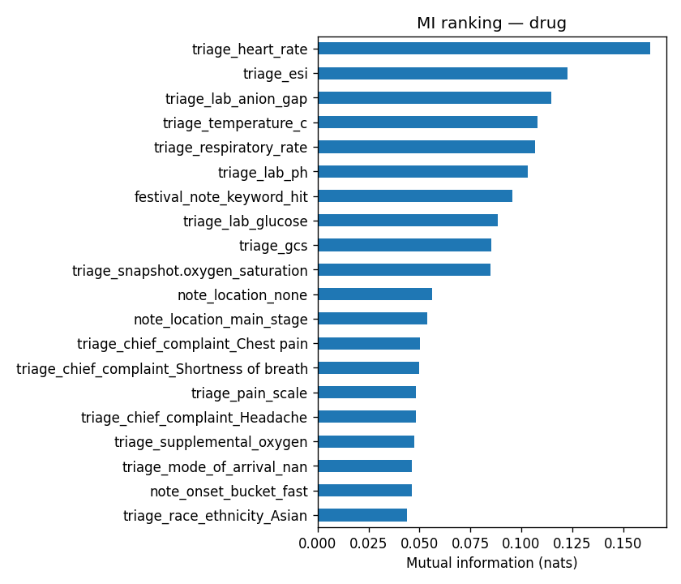
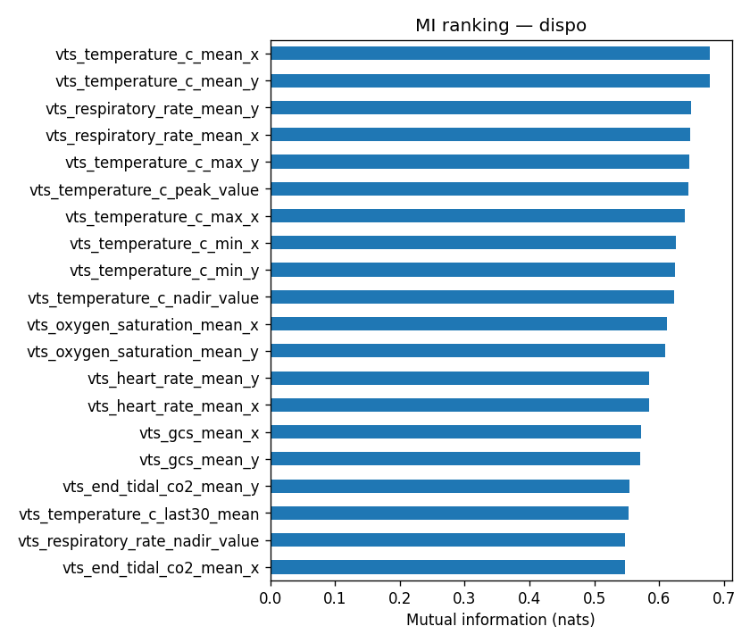
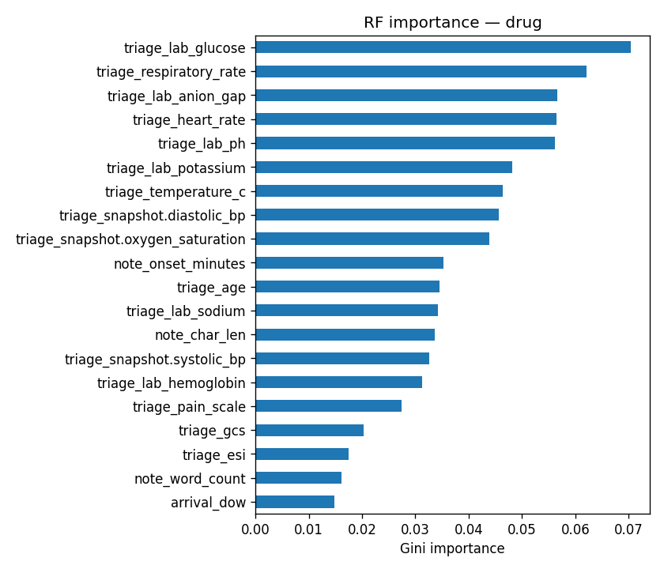
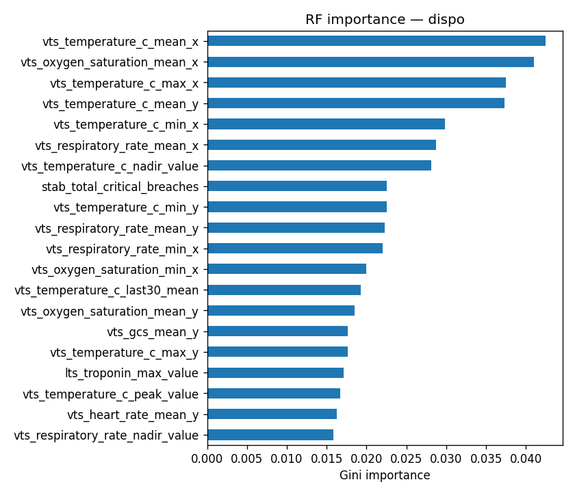
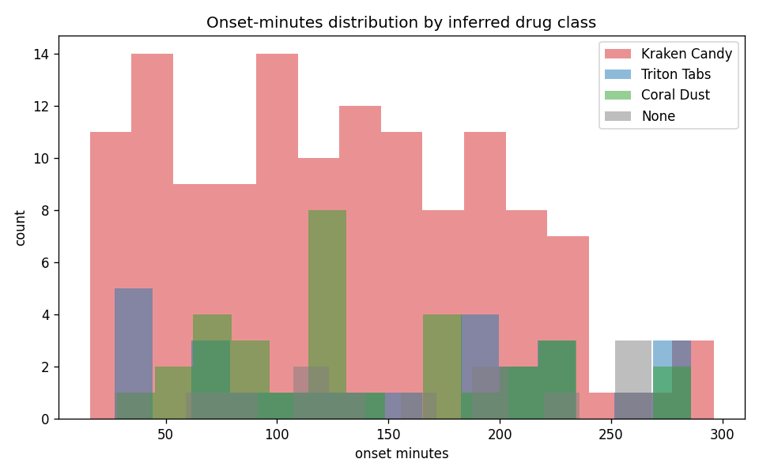

# Advanced EDA — Data Integrity, Missingness, Feature Importance

Auto-generated. Re-run: `./.venv/Scripts/python.exe src/eda/eda_advanced.py`

## A. Missingness

### features_triage.csv — 261 rows × 53 cols
- Columns with missing values: **1** (out of 53)
- Top-20 most-missing columns:

| Column | Missing | % |
|---|---:|---:|
| note_onset_minutes | 61 | 23.4% |

### features_fourh.csv — 261 rows × 535 cols
- Columns with missing values: **189** (out of 535)
- Top-20 most-missing columns:

| Column | Missing | % |
|---|---:|---:|
| xmod_hr_crit_to_benzo_min | 227 | 87.0% |
| ed_course_reassessment_4h.cpk_4h | 128 | 49.0% |
| ed_course_reassessment_4h.vbg_ph_4h | 128 | 49.0% |
| ed_course_reassessment_4h.troponin_4h | 128 | 49.0% |
| ed_course_reassessment_4h.lactate_4h | 128 | 49.0% |
| xmod_first_lab_to_first_itv_min | 68 | 26.1% |
| note_onset_minutes | 61 | 23.4% |
| lts_cbc_wbc_max | 47 | 18.0% |
| lts_cbc_wbc_last | 47 | 18.0% |
| lts_bmp_sodium_last | 47 | 18.0% |
| lts_bmp_potassium_min | 47 | 18.0% |
| lts_bmp_sodium_min | 47 | 18.0% |
| lts_bmp_sodium_max | 47 | 18.0% |
| lts_bmp_bicarb_min | 47 | 18.0% |
| lts_bmp_bicarb_max | 47 | 18.0% |
| lts_bmp_bicarb_last | 47 | 18.0% |
| lts_lft_ast_min | 47 | 18.0% |
| lts_lft_ast_max | 47 | 18.0% |
| lts_lft_ast_last | 47 | 18.0% |
| lts_vbg_ph_min | 47 | 18.0% |

### By-class missingness (4h features, key analytes)

| Column | Kraken | Triton | Coral | None |
|---|---:|---:|---:|---:|
| ed_course_reassessment_4h.lactate_4h | 41% | 53% | 64% | 67% |
| ed_course_reassessment_4h.cpk_4h | 41% | 53% | 64% | 67% |
| ed_course_reassessment_4h.vbg_ph_4h | 41% | 53% | 64% | 67% |
| ed_course_reassessment_4h.troponin_4h | 41% | 53% | 64% | 67% |
| lts_troponin_was_drawn | 0% | 0% | 0% | 0% |
| lts_lactate_was_drawn | 0% | 0% | 0% | 0% |

## B. Data integrity

- Duplicate `encounter_id` rows: triage=0, fourh=0
- encounter_id parity: triage∖fourh = 0, fourh∖triage = 0

### features_triage: constants and near-constants
- Constant numeric columns (1): ['note_location_food_village']
- Near-constant (>95% same value): 1
  - `note_location_shopping_area` (99.2%)

### features_fourh: constants and near-constants
- Constant numeric columns (23): ['itv_kw_fluid', 'itv_kw_naloxone', 'itv_kw_flumazenil', 'itv_kw_monitor', 'itv_kw_cool', 'itv_kw_physostigmine', 'itv_kw_vasopressor', 'vts_diastolic_bp_n_critical', 'vts_diastolic_bp_time_to_first_critical', 'vts_temperature_c_n_critical'] ...
- Near-constant (>95% same value): 9
  - `ed_course_reassessment_4h.cvc_0_4h` (95.4%)
  - `narrative_notes_structured_ct_head_abnormal` (96.6%)
  - `narrative_notes_structured_ct_abd_pelvis_abnormal` (98.9%)
  - `lts_hcg_positive_any` (97.7%)
  - `vts_systolic_bp_n_critical` (96.9%)
  - `vts_systolic_bp_time_to_first_critical` (96.9%)
  - `itv_intubation_after_benzo` (96.2%)
  - `supp_o2_escalated` (98.1%)
  - `note_location_shopping_area` (99.2%)

### Out-of-range vitals (triage)

### Highly correlated pairs (features_fourh, |r| > 0.9)
- (sampled 200 numeric columns for the correlation check)

| Feature A | Feature B | \|r\| |
|---|---|---:|
| lts_bmp_sodium_max | lts_bmp_sodium_max_value | 1.000 |
| lts_cbc_wbc_first_minute | lts_poct_glucose_first_minute | 1.000 |
| lts_cpk_first_minute | lts_poct_glucose_first_minute | 1.000 |
| lts_esr_max_value | lts_esr_max | 1.000 |
| vts_systolic_bp_last_x | ed_course_reassessment_4h.systolic_bp_4h | 1.000 |
| note_is_festival_template | note_location_none | 1.000 |
| lts_cpk_first_minute | lts_esr_first_minute | 1.000 |
| lts_cpk_first_minute | lts_bmp_bicarb_first_minute | 1.000 |
| lts_cpk_first_minute | lts_serum_osm_first_minute | 1.000 |
| lts_cpk_first_minute | lts_cbc_wbc_first_minute | 1.000 |
| lts_poct_glucose_first_minute | lts_bmp_bicarb_first_minute | 1.000 |
| lts_n_records | lts_cpk_n_draws | 1.000 |
| lts_cbc_wbc_first_minute | lts_bmp_bicarb_first_minute | 1.000 |
| lts_cbc_wbc_first_minute | lts_serum_osm_first_minute | 1.000 |
| lts_cbc_wbc_first_minute | lts_esr_first_minute | 1.000 |
| vts_oxygen_saturation_nadir_value | vts_oxygen_saturation_min_x | 1.000 |
| vts_heart_rate_last_x | ed_course_reassessment_4h.heart_rate_4h | 1.000 |
| vts_systolic_bp_last_x | vts_systolic_bp_last_y | 1.000 |
| note_is_festival_template | festival_note_keyword_hit | 1.000 |
| vts_systolic_bp_min_x | vts_systolic_bp_min_y | 1.000 |

## C. Univariate feature importance (mutual information)

### Task 1 — Drug class (argmax of probs_avg)

Top 20 features by MI:

| Rank | Feature | MI |
|---:|---|---:|
| 1 | triage_heart_rate | 0.1631 |
| 2 | triage_esi | 0.1227 |
| 3 | triage_lab_anion_gap | 0.1148 |
| 4 | triage_temperature_c | 0.1079 |
| 5 | triage_respiratory_rate | 0.1069 |
| 6 | triage_lab_ph | 0.1034 |
| 7 | festival_note_keyword_hit | 0.0955 |
| 8 | triage_lab_glucose | 0.0886 |
| 9 | triage_gcs | 0.0851 |
| 10 | triage_snapshot.oxygen_saturation | 0.0850 |
| 11 | note_location_none | 0.0562 |
| 12 | note_location_main_stage | 0.0538 |
| 13 | triage_chief_complaint_Chest pain | 0.0504 |
| 14 | triage_chief_complaint_Shortness of breath | 0.0500 |
| 15 | triage_pain_scale | 0.0484 |
| 16 | triage_chief_complaint_Headache | 0.0483 |
| 17 | triage_supplemental_oxygen | 0.0474 |
| 18 | triage_mode_of_arrival_nan | 0.0464 |
| 19 | note_onset_bucket_fast | 0.0462 |
| 20 | triage_race_ethnicity_Asian | 0.0439 |



### Task 2 — Disposition (Discharge/Floor/ICU, drug-positive cohort)

Top 20 features by MI:

| Rank | Feature | MI |
|---:|---|---:|
| 1 | vts_temperature_c_mean_x | 0.6779 |
| 2 | vts_temperature_c_mean_y | 0.6778 |
| 3 | vts_respiratory_rate_mean_y | 0.6491 |
| 4 | vts_respiratory_rate_mean_x | 0.6478 |
| 5 | vts_temperature_c_max_y | 0.6459 |
| 6 | vts_temperature_c_peak_value | 0.6452 |
| 7 | vts_temperature_c_max_x | 0.6396 |
| 8 | vts_temperature_c_min_x | 0.6257 |
| 9 | vts_temperature_c_min_y | 0.6237 |
| 10 | vts_temperature_c_nadir_value | 0.6231 |
| 11 | vts_oxygen_saturation_mean_x | 0.6123 |
| 12 | vts_oxygen_saturation_mean_y | 0.6093 |
| 13 | vts_heart_rate_mean_y | 0.5836 |
| 14 | vts_heart_rate_mean_x | 0.5836 |
| 15 | vts_gcs_mean_x | 0.5716 |
| 16 | vts_gcs_mean_y | 0.5708 |
| 17 | vts_end_tidal_co2_mean_y | 0.5537 |
| 18 | vts_temperature_c_last30_mean | 0.5531 |
| 19 | vts_respiratory_rate_nadir_value | 0.5470 |
| 20 | vts_end_tidal_co2_mean_x | 0.5466 |



## D. Tree-based (multivariate) feature importance

### Task 1 — Drug class

Top 20 features by RF importance (Gini):

| Rank | Feature | Importance |
|---:|---|---:|
| 1 | triage_lab_glucose | 0.0704 |
| 2 | triage_respiratory_rate | 0.0621 |
| 3 | triage_lab_anion_gap | 0.0567 |
| 4 | triage_heart_rate | 0.0565 |
| 5 | triage_lab_ph | 0.0561 |
| 6 | triage_lab_potassium | 0.0482 |
| 7 | triage_temperature_c | 0.0464 |
| 8 | triage_snapshot.diastolic_bp | 0.0457 |
| 9 | triage_snapshot.oxygen_saturation | 0.0439 |
| 10 | note_onset_minutes | 0.0352 |
| 11 | triage_age | 0.0345 |
| 12 | triage_lab_sodium | 0.0342 |
| 13 | note_char_len | 0.0336 |
| 14 | triage_snapshot.systolic_bp | 0.0326 |
| 15 | triage_lab_hemoglobin | 0.0313 |
| 16 | triage_pain_scale | 0.0274 |
| 17 | triage_gcs | 0.0203 |
| 18 | triage_esi | 0.0175 |
| 19 | note_word_count | 0.0162 |
| 20 | arrival_dow | 0.0148 |



### Task 2 — Disposition

Top 20 features by RF importance (Gini):

| Rank | Feature | Importance |
|---:|---|---:|
| 1 | vts_temperature_c_mean_x | 0.0425 |
| 2 | vts_oxygen_saturation_mean_x | 0.0410 |
| 3 | vts_temperature_c_max_x | 0.0375 |
| 4 | vts_temperature_c_mean_y | 0.0373 |
| 5 | vts_temperature_c_min_x | 0.0298 |
| 6 | vts_respiratory_rate_mean_x | 0.0288 |
| 7 | vts_temperature_c_nadir_value | 0.0281 |
| 8 | stab_total_critical_breaches | 0.0226 |
| 9 | vts_temperature_c_min_y | 0.0225 |
| 10 | vts_respiratory_rate_mean_y | 0.0223 |
| 11 | vts_respiratory_rate_min_x | 0.0221 |
| 12 | vts_oxygen_saturation_min_x | 0.0200 |
| 13 | vts_temperature_c_last30_mean | 0.0192 |
| 14 | vts_oxygen_saturation_mean_y | 0.0185 |
| 15 | vts_gcs_mean_y | 0.0176 |
| 16 | vts_temperature_c_max_y | 0.0176 |
| 17 | lts_troponin_max_value | 0.0172 |
| 18 | vts_temperature_c_peak_value | 0.0167 |
| 19 | vts_heart_rate_mean_y | 0.0163 |
| 20 | vts_respiratory_rate_nadir_value | 0.0158 |



## E. Target distributions

### Drug class (argmax of probs_avg)
```
argmax_class
Kraken Candy    160
Coral Dust       42
Triton Tabs      32
None             27
```

### Disposition
```
encounter_disposition_label
Discharge    171
Floor         52
ICU           38
```

### Drug × Disposition cross-tab
```
Empty DataFrame
Columns: []
Index: []
```

## F. Note-feature coverage

- Onset phrase parsed: **200/261 (76.6%)**
- Festival template:   **181/261 (69.3%)**
- onset_minutes range: [16, 296], median 126

### Mean onset_minutes by drug class

| Class | n with onset | mean | median |
|---|---:|---:|---:|
| Kraken Candy | 129 | 126 | 120 |
| Triton Tabs | 26 | 153 | 166 |
| Coral Dust | 32 | 140 | 122 |
| None | 13 | 164 | 171 |


