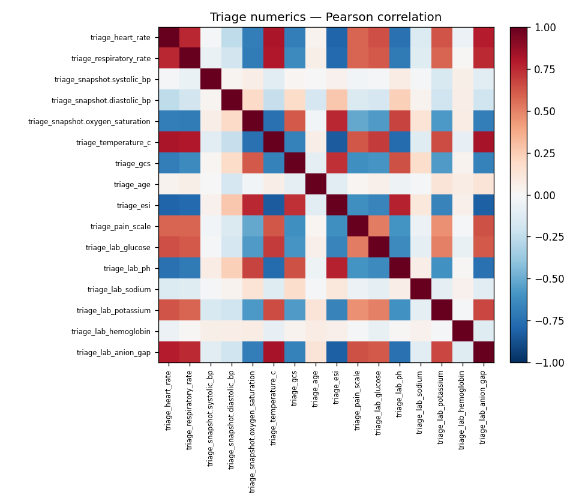
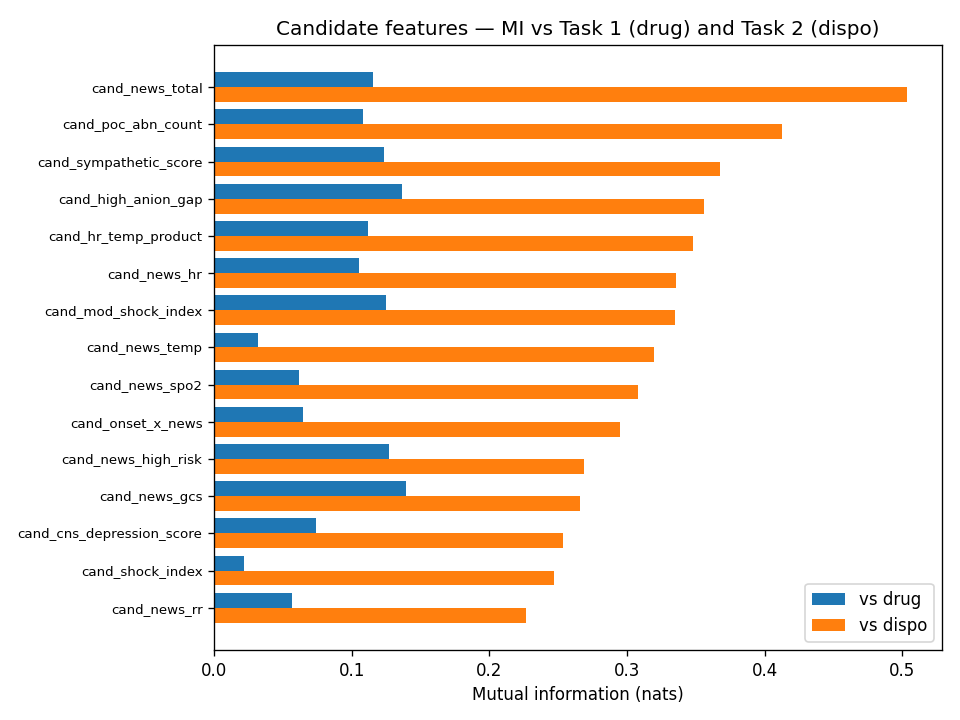

# Analysis: Descriptive EDA + Candidate-Feature Exploration

## Question

What does the dataset look like, what have we built, and what new features might lift Task-1 or Task-2 performance?

## Data

- features_triage.csv: **(261, 66)**
- features_fourh.csv:  **(261, 472)**
- probs_avg.csv:       **(261, 12)**  (soft Task-1 labels, argmax distribution shown below)
- Drug-positive cohort (Task 2): **234 patients**

## A. Dataset distributional profile

- Encounters: **261**
- Date range: `2025-05-18` to `2025-05-22` (5 unique days)
- Triage features: **66 cols**
- 4h features:     **472 cols**

### Numeric vitals + labs (first 25 cols)

| Feature | n | mean | sd | median | p25 | p75 | min | max | skew | kurt |
|---|---:|---:|---:|---:|---:|---:|---:|---:|---:|---:|
| triage_heart_rate | 261 | 103 | 23.46 | 98.70 | 85.30 | 116 | 59.70 | 174 | 0.75 | 0.13 |
| triage_respiratory_rate | 261 | 23.08 | 7.17 | 21.70 | 18.00 | 27.50 | 8.00 | 45.60 | 0.64 | 0.02 |
| triage_snapshot.systolic_bp | 261 | 120 | 15.83 | 120 | 110 | 131 | 71.80 | 161 | 0.01 | -0.09 |
| triage_snapshot.diastolic_bp | 261 | 73.42 | 8.47 | 73.00 | 67.40 | 79.70 | 49.90 | 96.90 | -0.00 | -0.33 |
| triage_snapshot.oxygen_saturation | 261 | 95.45 | 2.35 | 95.90 | 94.00 | 97.10 | 88.90 | 99.90 | -0.68 | -0.02 |
| triage_supplemental_oxygen | 261 | 0.24 | 0.43 | 0.00 | 0.00 | 0.00 | 0.00 | 1.00 | 1.23 | -0.48 |
| triage_temperature_c | 261 | 37.56 | 0.65 | 37.40 | 37.08 | 37.99 | 36.28 | 39.35 | 0.62 | -0.32 |
| triage_gcs | 261 | 12.79 | 1.58 | 13.00 | 12.00 | 14.00 | 9.00 | 15.00 | -0.36 | -0.74 |
| triage_age | 261 | 36.89 | 14.37 | 38.00 | 26.00 | 46.00 | 14.00 | 80.00 | 0.27 | -0.37 |
| triage_esi | 261 | 3.54 | 1.29 | 4.00 | 3.00 | 5.00 | 1.00 | 5.00 | -0.48 | -0.85 |
| triage_pain_scale | 261 | 5.20 | 2.74 | 5.00 | 3.00 | 7.00 | 0.00 | 10.00 | 0.10 | -0.94 |
| triage_mh_psych | 261 | 0.20 | 0.40 | 0.00 | 0.00 | 0.00 | 0.00 | 1.00 | 1.54 | 0.36 |
| triage_mh_cardiac | 261 | 0.21 | 0.41 | 0.00 | 0.00 | 0.00 | 0.00 | 1.00 | 1.39 | -0.07 |
| triage_mh_pulm | 261 | 0.21 | 0.41 | 0.00 | 0.00 | 0.00 | 0.00 | 1.00 | 1.45 | 0.09 |
| triage_mh_renal | 261 | 0.11 | 0.31 | 0.00 | 0.00 | 0.00 | 0.00 | 1.00 | 2.47 | 4.12 |
| triage_mh_substance_use | 261 | 0.25 | 0.43 | 0.00 | 0.00 | 0.00 | 0.00 | 1.00 | 1.16 | -0.65 |
| triage_lab_glucose | 261 | 112 | 24.05 | 111 | 95.90 | 128 | 46.00 | 177 | 0.20 | -0.30 |
| triage_lab_ph | 261 | 7.36 | 0.05 | 7.37 | 7.33 | 7.40 | 7.22 | 7.49 | -0.43 | -0.28 |
| triage_lab_sodium | 261 | 138 | 2.98 | 138 | 136 | 140 | 130 | 147 | 0.13 | 0.33 |
| triage_lab_potassium | 261 | 4.39 | 0.48 | 4.37 | 4.02 | 4.66 | 3.21 | 5.82 | 0.29 | -0.11 |
| triage_lab_hemoglobin | 261 | 13.89 | 1.48 | 13.90 | 12.90 | 14.90 | 9.90 | 18.30 | 0.00 | -0.13 |
| triage_lab_anion_gap | 261 | 11.66 | 3.97 | 11.00 | 8.60 | 14.30 | 4.00 | 22.90 | 0.50 | -0.34 |
| is_festival_patient | 261 | 0.70 | 0.46 | 1.00 | 0.00 | 1.00 | 0.00 | 1.00 | -0.88 | -1.23 |
| festival_note_keyword_hit | 261 | 0.69 | 0.46 | 1.00 | 0.00 | 1.00 | 0.00 | 1.00 | -0.84 | -1.30 |
| arrival_day_of_festival | 261 | 2.36 | 1.43 | 3.00 | 1.00 | 4.00 | 0.00 | 4.00 | -0.38 | -1.19 |

### Categorical fields (top values)

**encounter_arrival_date** (5 unique)
  - `2025-05-22`: 74
  - `2025-05-21`: 65
  - `2025-05-20`: 43
  - `2025-05-18`: 41
  - `2025-05-19`: 38

**triage_sex_gender** (3 unique)
  - `Male`: 138
  - `Female`: 117
  - `Non-binary`: 6

**triage_race_ethnicity** (6 unique)
  - `White`: 124
  - `Hispanic/Latino`: 49
  - `Black`: 47
  - `Asian`: 26
  - `Other/Multiracial`: 9
  - `Native American`: 6

**triage_mode_of_arrival** (4 unique)
  - `Walk-in`: 126
  - `EMS`: 88
  - `Festival Medical Tent Transfer`: 32
  - `Police`: 15

## B. Engineered-feature family overview

| Family | Triage cols | 4h cols | Description |
|---|---:|---:|---|
| triage vitals | 8 | 8 | Vitals captured at triage (minute 0) |
| triage demographics | 3 | 3 | Age, sex, race |
| triage POC labs | 6 | 6 | iStat panel at triage (glucose, pH, Na, K, Hgb, anion gap) |
| PMH flags | 5 | 5 | Past medical history (psych/cardiac/pulm/renal/substance) |
| arrival/context | 7 | 7 | Festival exposure markers + day of festival |
| note features | 19 | 19 | Onset minutes + festival location parsed from triage_brief_note |
| 4h reassessment | 0 | 22 | Vitals + labs + intervention flags at 4h mark |
| vital time-series agg | 0 | 145 | Slopes / peaks / recovery half-time from minute-level vitals |
| lab time-series agg | 0 | 133 | Per-analyte trajectory (first/last/n_draws/delta) |
| intervention seq | 0 | 27 | Time-to-first-X, escalation ladder, intubation-after-benzo |
| cross-modal | 0 | 2 | Latency between labs and interventions, HR-crit to benzo |
| stability | 0 | 3 | Critical-band breach count, oscillation count |
| recovery arc | 0 | 4 | Trajectory class, time-to-min-GCS, steady-state flag |
| differentials | 0 | 37 | Triage <-> 4h paired deltas, pct-change, direction signs |
| imaging abn flags | 0 | 5 | EKG/CXR/CT abnormal binary flags (at 4h) |

## C. Outlier flagging (Tukey 1.5 x IQR)

Flags — does not delete. Outliers in synthetic data may be intentional severity cases.

| Feature | n_low | n_high | low fence | high fence |
|---|---:|---:|---:|---:|
| triage_heart_rate | 0 | 6 | 39.40 | 162 |
| triage_respiratory_rate | 0 | 4 | 3.75 | 41.75 |
| triage_snapshot.systolic_bp | 1 | 0 | 79.45 | 162 |
| triage_snapshot.diastolic_bp | 0 | 0 | 48.95 | 98.15 |
| triage_snapshot.oxygen_saturation | 5 | 0 | 89.35 | 102 |
| triage_temperature_c | 0 | 0 | 35.71 | 39.36 |
| triage_gcs | 0 | 0 | 9.00 | 17.00 |
| triage_age | 0 | 2 | -4.00 | 76.00 |
| triage_lab_glucose | 1 | 1 | 47.45 | 177 |
| triage_lab_ph | 2 | 0 | 7.22 | 7.51 |
| triage_lab_anion_gap | 0 | 1 | 0.05 | 22.85 |
| triage_lab_potassium | 0 | 2 | 3.06 | 5.62 |

## D. Correlation among triage numeric features

### Top-15 Pearson correlation pairs (triage features)

| Feature A | Feature B | Pearson r | Spearman r |
|---|---|---:|---:|
| triage_temperature_c | triage_esi | -0.834 | -0.808 |
| triage_temperature_c | triage_lab_anion_gap | 0.822 | 0.781 |
| triage_heart_rate | triage_temperature_c | 0.817 | 0.814 |
| triage_esi | triage_lab_anion_gap | -0.817 | -0.795 |
| triage_heart_rate | triage_esi | -0.803 | -0.794 |
| triage_respiratory_rate | triage_temperature_c | 0.801 | 0.737 |
| triage_heart_rate | triage_lab_anion_gap | 0.786 | 0.756 |
| triage_respiratory_rate | triage_esi | -0.781 | -0.755 |
| triage_esi | triage_lab_ph | 0.769 | 0.748 |
| triage_temperature_c | triage_lab_ph | -0.769 | -0.733 |
| triage_snapshot.oxygen_saturation | triage_esi | 0.757 | 0.720 |
| triage_heart_rate | triage_respiratory_rate | 0.753 | 0.716 |
| triage_respiratory_rate | triage_lab_anion_gap | 0.750 | 0.714 |
| triage_lab_ph | triage_lab_anion_gap | -0.748 | -0.713 |
| triage_heart_rate | triage_lab_ph | -0.745 | -0.723 |

## E. Candidate new-feature exploration

### Coverage (non-null counts)

| Candidate | n_non_null | mean | median | min | max |
|---|---:|---:|---:|---:|---:|
| cand_shock_index | 261 | 0.87 | 0.82 | 0.45 | 1.88 |
| cand_mod_shock_index | 261 | 1.17 | 1.11 | 0.58 | 2.36 |
| cand_pulse_pressure | 261 | 46.98 | 47.60 | -1.00 | 94.00 |
| cand_map | 261 | 89.08 | 89.20 | 67.17 | 107 |
| cand_shock_index_age | 261 | 32.23 | 29.69 | 8.38 | 107 |
| cand_rate_pressure_product | 261 | 12369 | 11637 | 6674 | 24706 |
| cand_hr_temp_product | 261 | 3874 | 3668 | 2211 | 6771 |
| cand_k_extreme | 261 | 0.14 | 0.00 | 0.00 | 1.00 |
| cand_na_extreme | 261 | 0.17 | 0.00 | 0.00 | 1.00 |
| cand_glucose_extreme | 261 | 0.03 | 0.00 | 0.00 | 1.00 |
| cand_high_anion_gap | 261 | 0.42 | 0.00 | 0.00 | 1.00 |
| cand_acidosis | 261 | 0.38 | 0.00 | 0.00 | 1.00 |
| cand_alkalosis | 261 | 0.02 | 0.00 | 0.00 | 1.00 |
| cand_poc_abn_count | 261 | 1.16 | 1.00 | 0.00 | 4.00 |
| cand_news_hr | 261 | 1.09 | 1.00 | 0.00 | 3.00 |
| cand_news_rr | 261 | 1.52 | 2.00 | 0.00 | 3.00 |
| cand_news_sbp | 261 | 0.38 | 0.00 | 0.00 | 3.00 |
| cand_news_spo2 | 261 | 0.58 | 0.00 | 0.00 | 3.00 |
| cand_news_temp | 261 | 0.44 | 0.00 | 0.00 | 3.00 |
| cand_news_gcs | 261 | 1.69 | 2.00 | 0.00 | 3.00 |
| cand_news_total | 261 | 5.70 | 4.00 | 0.00 | 16.00 |
| cand_news_high_risk | 261 | 0.49 | 0.00 | 0.00 | 1.00 |
| cand_onset_x_news | 200 | 0.09 | 0.04 | 0.00 | 0.94 |
| cand_onset_x_hr | 200 | 1.33 | 0.84 | 0.23 | 8.94 |
| cand_log_onset | 200 | 4.72 | 4.84 | 2.83 | 5.69 |
| cand_is_fast_onset | 261 | 0.14 | 0.00 | 0.00 | 1.00 |
| cand_is_slow_onset | 261 | 0.23 | 0.00 | 0.00 | 1.00 |
| cand_pmh_count | 261 | 0.98 | 1.00 | 0.00 | 5.00 |
| cand_sympathetic_score | 261 | 1.31 | 1.00 | 0.00 | 4.00 |
| cand_cns_depression_score | 261 | 0.80 | 1.00 | 0.00 | 2.00 |

### Candidate mutual information vs targets

Top MI for each task (higher = more informative):

| Candidate | MI(drug) | MI(disposition) |
|---|---:|---:|
| cand_shock_index | 0.0220 | 0.2472 |
| cand_mod_shock_index | 0.1246 | 0.3348 |
| cand_pulse_pressure | 0.0290 | 0.0327 |
| cand_map | 0.0338 | 0.0000 |
| cand_shock_index_age | 0.1079 | 0.1612 |
| cand_rate_pressure_product | 0.0050 | 0.2143 |
| cand_hr_temp_product | 0.1121 | 0.3476 |
| cand_k_extreme | 0.0085 | 0.1124 |
| cand_na_extreme | 0.0106 | 0.0905 |
| cand_glucose_extreme | 0.0090 | 0.0000 |
| cand_high_anion_gap | 0.1367 | 0.3558 |
| cand_acidosis | 0.0413 | 0.2158 |
| cand_alkalosis | 0.0000 | 0.0115 |
| cand_poc_abn_count | 0.1078 | 0.4127 |
| cand_news_hr | 0.1052 | 0.3353 |
| cand_news_rr | 0.0568 | 0.2269 |
| cand_news_sbp | 0.0531 | 0.0416 |
| cand_news_spo2 | 0.0614 | 0.3079 |
| cand_news_temp | 0.0322 | 0.3194 |
| cand_news_gcs | 0.1396 | 0.2661 |
| cand_news_total | 0.1156 | 0.5037 |
| cand_news_high_risk | 0.1273 | 0.2686 |
| cand_onset_x_news | 0.0648 | 0.2950 |
| cand_onset_x_hr | 0.0793 | 0.1438 |
| cand_log_onset | 0.0309 | 0.0588 |
| cand_is_fast_onset | 0.0000 | 0.0173 |
| cand_is_slow_onset | 0.0000 | 0.0000 |
| cand_pmh_count | 0.0000 | 0.0099 |
| cand_sympathetic_score | 0.1232 | 0.3676 |
| cand_cns_depression_score | 0.0737 | 0.2536 |

## F. Commit recommendation

Commit threshold: max(MI) >= 0.03

Kept: **25 candidates**

| Committed feature | MI(drug) | MI(dispo) |
|---|---:|---:|
| cand_acidosis | 0.0413 | 0.2158 |
| cand_cns_depression_score | 0.0737 | 0.2536 |
| cand_high_anion_gap | 0.1367 | 0.3558 |
| cand_hr_temp_product | 0.1121 | 0.3476 |
| cand_k_extreme | 0.0085 | 0.1124 |
| cand_log_onset | 0.0309 | 0.0588 |
| cand_map | 0.0338 | 0.0000 |
| cand_mod_shock_index | 0.1246 | 0.3348 |
| cand_na_extreme | 0.0106 | 0.0905 |
| cand_news_gcs | 0.1396 | 0.2661 |
| cand_news_high_risk | 0.1273 | 0.2686 |
| cand_news_hr | 0.1052 | 0.3353 |
| cand_news_rr | 0.0568 | 0.2269 |
| cand_news_sbp | 0.0531 | 0.0416 |
| cand_news_spo2 | 0.0614 | 0.3079 |
| cand_news_temp | 0.0322 | 0.3194 |
| cand_news_total | 0.1156 | 0.5037 |
| cand_onset_x_hr | 0.0793 | 0.1438 |
| cand_onset_x_news | 0.0648 | 0.2950 |
| cand_poc_abn_count | 0.1078 | 0.4127 |
| cand_pulse_pressure | 0.0290 | 0.0327 |
| cand_rate_pressure_product | 0.0050 | 0.2143 |
| cand_shock_index | 0.0220 | 0.2472 |
| cand_shock_index_age | 0.1079 | 0.1612 |
| cand_sympathetic_score | 0.1232 | 0.3676 |

Wrote `exploratory_features.csv` (261 rows x 26 cols). Merge into features_triage.csv / features_fourh.csv as the next pipeline step before re-training.

## Reproducibility

- Code: `src/eda/eda_descriptive.py`
- Seed: 42
- Libraries: pandas=3.0.2, numpy=2.4.4, scikit-learn=1.8.0, scipy=1.17.1
- Outputs: `eda_descriptive_report.md`, `exploratory_features.csv`, plots in `eda_plots/`
