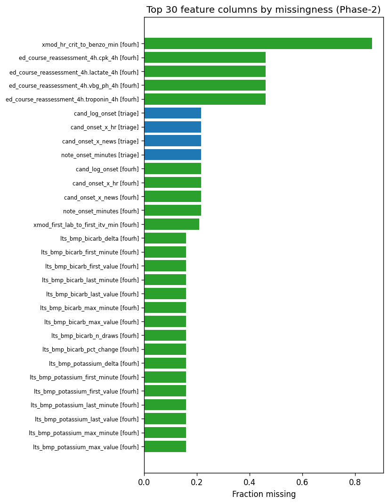
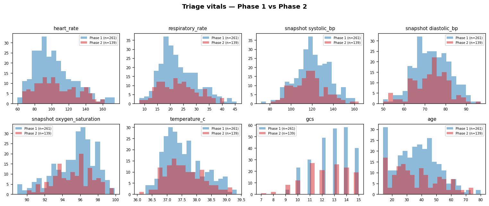
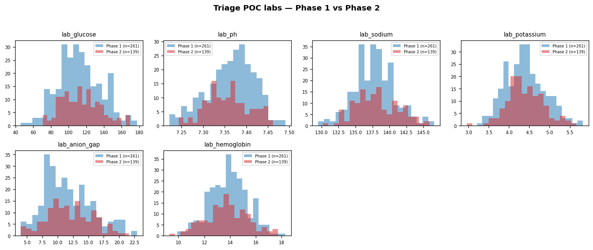

# Phase-2 EDA + Integrity Report

Source: `data2/Hackathon_Data_Release_2_SHARE.xlsx`

## Cohort

| Table | Phase-1 rows × cols | Phase-2 rows × cols |
|---|---:|---:|
| features_triage | (261, 84) | (139, 88) |
| features_fourh  | (261, 475)  | (139, 476) |

Phase-2 arrival-date range: `2026-05-11` → `2026-05-15`
(Phase-1: `2025-05-18` → `2025-05-22`)

## Integrity test results

**0 FAIL / 24 PASS** out of 24 tests.

| Test | Result | Detail |
|---|---|---|
| `encounter_id_unique__triage` | PASS | 0 duplicate(s) |
| `encounter_id_unique__fourh` | PASS | 0 duplicate(s) |
| `cohort_match_triage_vs_fourh` | PASS | only_in_triage=0  only_in_fourh=0 |
| `arrival_date_in_2024_2027` | PASS | range = [2026-05-11 00:00:00, 2026-05-15 00:00:00] |
| `vital_in_range__triage_heart_rate` | PASS | 0 value(s) outside [20, 250] |
| `vital_in_range__triage_respiratory_rate` | PASS | 0 value(s) outside [4, 60] |
| `vital_in_range__triage_snapshot.systolic_bp` | PASS | 0 value(s) outside [50, 260] |
| `vital_in_range__triage_snapshot.diastolic_bp` | PASS | 0 value(s) outside [20, 160] |
| `vital_in_range__triage_snapshot.oxygen_saturation` | PASS | 0 value(s) outside [40, 100] |
| `vital_in_range__triage_temperature_c` | PASS | 0 value(s) outside [32.0, 42.5] |
| `vital_in_range__triage_gcs` | PASS | 0 value(s) outside [3, 15] |
| `vital_in_range__triage_age` | PASS | 0 value(s) outside [0, 120] |
| `vital_in_range__triage_lab_glucose` | PASS | 0 value(s) outside [20, 1200] |
| `vital_in_range__triage_lab_ph` | PASS | 0 value(s) outside [6.7, 7.8] |
| `vital_in_range__triage_lab_sodium` | PASS | 0 value(s) outside [110, 175] |
| `vital_in_range__triage_lab_potassium` | PASS | 0 value(s) outside [1.5, 8.0] |
| `vital_in_range__triage_lab_anion_gap` | PASS | 0 value(s) outside [0, 50] |
| `vital_in_range__triage_lab_hemoglobin` | PASS | 0 value(s) outside [4, 22] |
| `no_outcome_columns__triage` | PASS | leaked=[] |
| `no_outcome_columns__fourh` | PASS | leaked=[] |
| `no_all_nan_columns__triage` | PASS | all-NaN count = 0: [] |
| `no_all_nan_columns__fourh` | PASS | all-NaN count = 0: [] |
| `no_duplicate_columns__triage` | PASS | dups=[] |
| `no_duplicate_columns__fourh` | PASS | dups=[] |

## Top-30 most-missing features

| Table | Column | n_missing | pct_missing |
|---|---|---:|---:|
| triage | `cand_log_onset` | 30 | 21.58% |
| triage | `cand_onset_x_hr` | 30 | 21.58% |
| triage | `cand_onset_x_news` | 30 | 21.58% |
| triage | `note_onset_minutes` | 30 | 21.58% |
| fourh | `xmod_hr_crit_to_benzo_min` | 120 | 86.33% |
| fourh | `ed_course_reassessment_4h.cpk_4h` | 64 | 46.04% |
| fourh | `ed_course_reassessment_4h.lactate_4h` | 64 | 46.04% |
| fourh | `ed_course_reassessment_4h.troponin_4h` | 64 | 46.04% |
| fourh | `ed_course_reassessment_4h.vbg_ph_4h` | 64 | 46.04% |
| fourh | `cand_log_onset` | 30 | 21.58% |
| fourh | `cand_onset_x_hr` | 30 | 21.58% |
| fourh | `cand_onset_x_news` | 30 | 21.58% |
| fourh | `note_onset_minutes` | 30 | 21.58% |
| fourh | `xmod_first_lab_to_first_itv_min` | 29 | 20.86% |
| fourh | `lts_bmp_bicarb_delta` | 22 | 15.83% |
| fourh | `lts_bmp_bicarb_first_minute` | 22 | 15.83% |
| fourh | `lts_bmp_bicarb_first_value` | 22 | 15.83% |
| fourh | `lts_bmp_bicarb_last_minute` | 22 | 15.83% |
| fourh | `lts_bmp_bicarb_last_value` | 22 | 15.83% |
| fourh | `lts_bmp_bicarb_max_minute` | 22 | 15.83% |
| fourh | `lts_bmp_bicarb_max_value` | 22 | 15.83% |
| fourh | `lts_bmp_bicarb_n_draws` | 22 | 15.83% |
| fourh | `lts_bmp_bicarb_pct_change` | 22 | 15.83% |
| fourh | `lts_bmp_potassium_delta` | 22 | 15.83% |
| fourh | `lts_bmp_potassium_first_minute` | 22 | 15.83% |
| fourh | `lts_bmp_potassium_first_value` | 22 | 15.83% |
| fourh | `lts_bmp_potassium_last_minute` | 22 | 15.83% |
| fourh | `lts_bmp_potassium_last_value` | 22 | 15.83% |
| fourh | `lts_bmp_potassium_max_minute` | 22 | 15.83% |
| fourh | `lts_bmp_potassium_max_value` | 22 | 15.83% |

## Vital-sign distributions — Phase 1 vs Phase 2

## Triage POC labs — Phase 1 vs Phase 2

## Largest Phase-1 → Phase-2 distribution shifts

Cohen's d ≥ 0.5 indicates a non-trivial shift. d > 0 → Phase-2 mean is higher than Phase-1.

| Table | Feature | Phase-1 mean | Phase-2 mean | Δ | Cohen d |
|---|---|---:|---:|---:|---:|
| triage | `arrival_day_of_festival` | 2.36 | 360.50 | +358.15 | +256.39 |
| fourh | `arrival_day_of_festival` | 2.36 | 360.50 | +358.15 | +256.39 |

## Numeric-feature summary statistics (triage)

Showing only numeric columns with non-missing values; full table in `feature_summary_stats.csv`.

| Column | n | Missing | Mean | Median | Std | Min | Max |
|---|---:|---:|---:|---:|---:|---:|---:|
| `triage_heart_rate` | 139 | 0% | 105.46 | 101.30 | 23.38 | 65.40 | 162.20 |
| `triage_respiratory_rate` | 139 | 0% | 23.10 | 22.60 | 7.22 | 8.10 | 40.80 |
| `triage_snapshot.systolic_bp` | 139 | 0% | 116.88 | 117.00 | 15.00 | 81.20 | 163.90 |
| `triage_snapshot.diastolic_bp` | 139 | 0% | 72.68 | 73.70 | 8.53 | 50.00 | 96.90 |
| `triage_snapshot.oxygen_saturation` | 139 | 0% | 95.25 | 95.40 | 2.13 | 90.00 | 99.80 |
| `triage_supplemental_oxygen` | 139 | 0% | 0.37 | 0.00 | 0.48 | 0.00 | 1.00 |
| `triage_temperature_c` | 139 | 0% | 37.59 | 37.50 | 0.63 | 36.07 | 39.20 |
| `triage_gcs` | 139 | 0% | 12.29 | 12.00 | 1.87 | 7.00 | 15.00 |
| `triage_age` | 139 | 0% | 36.41 | 33.00 | 15.37 | 14.00 | 75.00 |
| `triage_esi` | 139 | 0% | 3.42 | 4.00 | 1.19 | 1.00 | 5.00 |
| `triage_pain_scale` | 139 | 0% | 5.29 | 5.00 | 2.67 | 0.00 | 10.00 |
| `triage_mh_psych` | 139 | 0% | 0.22 | 0.00 | 0.42 | 0.00 | 1.00 |
| `triage_mh_cardiac` | 139 | 0% | 0.19 | 0.00 | 0.39 | 0.00 | 1.00 |
| `triage_mh_pulm` | 139 | 0% | 0.16 | 0.00 | 0.37 | 0.00 | 1.00 |
| `triage_mh_renal` | 139 | 0% | 0.12 | 0.00 | 0.33 | 0.00 | 1.00 |
| `triage_mh_substance_use` | 139 | 0% | 0.19 | 0.00 | 0.40 | 0.00 | 1.00 |
| `triage_lab_glucose` | 139 | 0% | 114.05 | 112.10 | 21.87 | 70.70 | 169.60 |
| `triage_lab_ph` | 139 | 0% | 7.36 | 7.36 | 0.05 | 7.24 | 7.46 |
| `triage_lab_sodium` | 139 | 0% | 138.08 | 137.70 | 3.14 | 130.20 | 145.90 |
| `triage_lab_potassium` | 139 | 0% | 4.40 | 4.41 | 0.45 | 2.96 | 5.66 |
| `triage_lab_hemoglobin` | 139 | 0% | 13.75 | 13.70 | 1.63 | 9.30 | 17.70 |
| `triage_lab_anion_gap` | 139 | 0% | 11.93 | 11.60 | 3.69 | 4.00 | 21.60 |
| `is_festival_patient` | 139 | 0% | 0.73 | 1.00 | 0.45 | 0.00 | 1.00 |
| `festival_note_keyword_hit` | 139 | 0% | 0.73 | 1.00 | 0.45 | 0.00 | 1.00 |
| `arrival_day_of_festival` | 139 | 0% | 360.50 | 361.00 | 1.34 | 358.00 | 362.00 |

## Files

- `derived/phase2/feature_summary_stats.csv` — per-column stats
- `derived/phase2/missingness.csv` — per-column NA counts
- `derived/phase2/integrity_results.csv` — pass/fail per test
- `derived/phase2/phase1_vs_phase2_shift.csv` — distribution shift
- `derived/phase2/eda_plots/` — histograms + missingness bar chart
