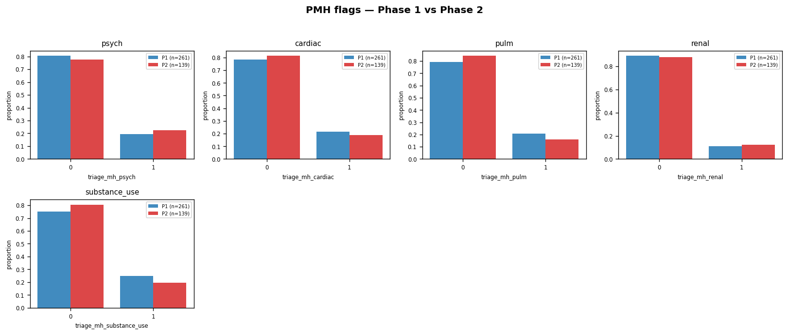
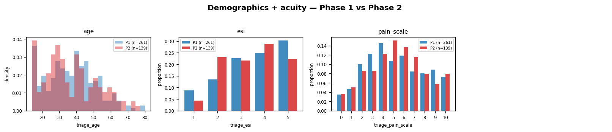
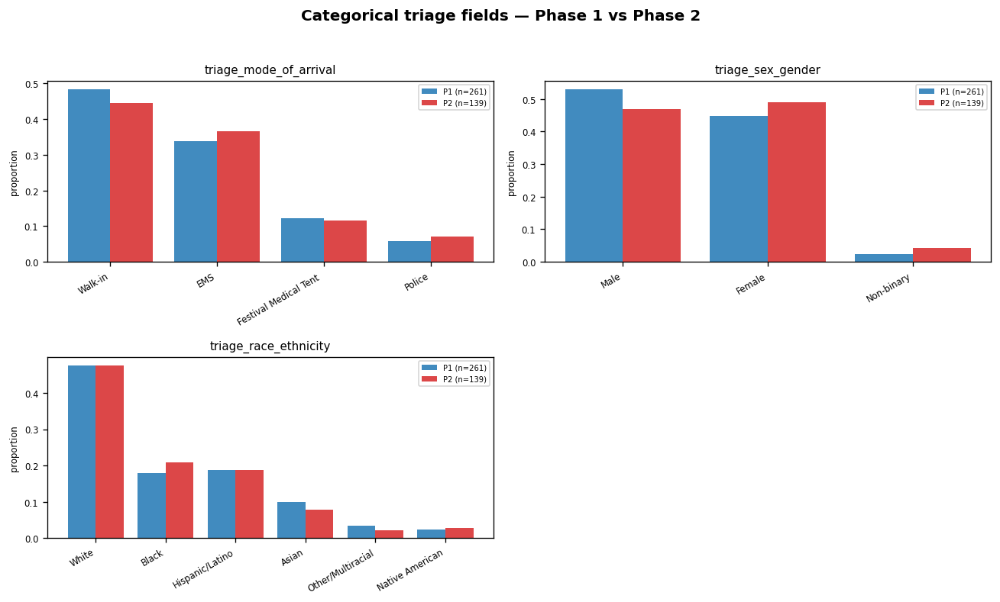
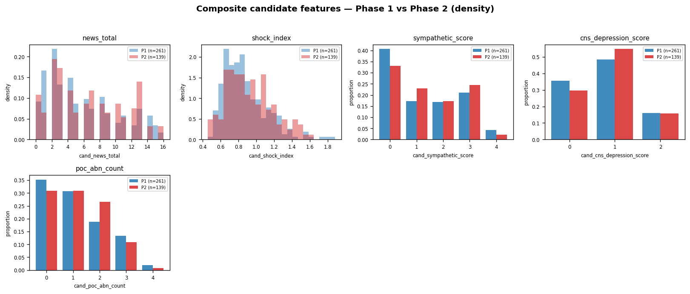

# Phase-2 EDA + Integrity Report

Source: `data2/Hackathon_Data_Release_2_SHARE.xlsx`

## Cohort

| Table | Phase-1 rows × cols | Phase-2 rows × cols |
|---|---:|---:|
| features_triage | (261, 84) | (139, 88) |
| features_fourh  | (261, 475)  | (139, 476) |

Phase-2 arrival-date range: `2026-05-11` → `2026-05-15`
(Phase-1: `2025-05-18` → `2025-05-22`)

## Integrity test results

**0 FAIL / 24 PASS** out of 24 tests.

| Test | Result | Detail |
|---|---|---|
| `encounter_id_unique__triage` | PASS | 0 duplicate(s) |
| `encounter_id_unique__fourh` | PASS | 0 duplicate(s) |
| `cohort_match_triage_vs_fourh` | PASS | only_in_triage=0  only_in_fourh=0 |
| `arrival_date_in_2024_2027` | PASS | range = [2026-05-11 00:00:00, 2026-05-15 00:00:00] |
| `vital_in_range__triage_heart_rate` | PASS | 0 value(s) outside [20, 250] |
| `vital_in_range__triage_respiratory_rate` | PASS | 0 value(s) outside [4, 60] |
| `vital_in_range__triage_snapshot.systolic_bp` | PASS | 0 value(s) outside [50, 260] |
| `vital_in_range__triage_snapshot.diastolic_bp` | PASS | 0 value(s) outside [20, 160] |
| `vital_in_range__triage_snapshot.oxygen_saturation` | PASS | 0 value(s) outside [40, 100] |
| `vital_in_range__triage_temperature_c` | PASS | 0 value(s) outside [32.0, 42.5] |
| `vital_in_range__triage_gcs` | PASS | 0 value(s) outside [3, 15] |
| `vital_in_range__triage_age` | PASS | 0 value(s) outside [0, 120] |
| `vital_in_range__triage_lab_glucose` | PASS | 0 value(s) outside [20, 1200] |
| `vital_in_range__triage_lab_ph` | PASS | 0 value(s) outside [6.7, 7.8] |
| `vital_in_range__triage_lab_sodium` | PASS | 0 value(s) outside [110, 175] |
| `vital_in_range__triage_lab_potassium` | PASS | 0 value(s) outside [1.5, 8.0] |
| `vital_in_range__triage_lab_anion_gap` | PASS | 0 value(s) outside [0, 50] |
| `vital_in_range__triage_lab_hemoglobin` | PASS | 0 value(s) outside [4, 22] |
| `no_outcome_columns__triage` | PASS | leaked=[] |
| `no_outcome_columns__fourh` | PASS | leaked=[] |
| `no_all_nan_columns__triage` | PASS | all-NaN count = 0: [] |
| `no_all_nan_columns__fourh` | PASS | all-NaN count = 0: [] |
| `no_duplicate_columns__triage` | PASS | dups=[] |
| `no_duplicate_columns__fourh` | PASS | dups=[] |

## Top-30 most-missing features

| Table | Column | n_missing | pct_missing |
|---|---|---:|---:|
| triage | `cand_log_onset` | 30 | 21.58% |
| triage | `cand_onset_x_hr` | 30 | 21.58% |
| triage | `cand_onset_x_news` | 30 | 21.58% |
| triage | `note_onset_minutes` | 30 | 21.58% |
| fourh | `xmod_hr_crit_to_benzo_min` | 120 | 86.33% |
| fourh | `ed_course_reassessment_4h.cpk_4h` | 64 | 46.04% |
| fourh | `ed_course_reassessment_4h.lactate_4h` | 64 | 46.04% |
| fourh | `ed_course_reassessment_4h.troponin_4h` | 64 | 46.04% |
| fourh | `ed_course_reassessment_4h.vbg_ph_4h` | 64 | 46.04% |
| fourh | `cand_log_onset` | 30 | 21.58% |
| fourh | `cand_onset_x_hr` | 30 | 21.58% |
| fourh | `cand_onset_x_news` | 30 | 21.58% |
| fourh | `note_onset_minutes` | 30 | 21.58% |
| fourh | `xmod_first_lab_to_first_itv_min` | 29 | 20.86% |
| fourh | `lts_bmp_bicarb_delta` | 22 | 15.83% |
| fourh | `lts_bmp_bicarb_first_minute` | 22 | 15.83% |
| fourh | `lts_bmp_bicarb_first_value` | 22 | 15.83% |
| fourh | `lts_bmp_bicarb_last_minute` | 22 | 15.83% |
| fourh | `lts_bmp_bicarb_last_value` | 22 | 15.83% |
| fourh | `lts_bmp_bicarb_max_minute` | 22 | 15.83% |
| fourh | `lts_bmp_bicarb_max_value` | 22 | 15.83% |
| fourh | `lts_bmp_bicarb_n_draws` | 22 | 15.83% |
| fourh | `lts_bmp_bicarb_pct_change` | 22 | 15.83% |
| fourh | `lts_bmp_potassium_delta` | 22 | 15.83% |
| fourh | `lts_bmp_potassium_first_minute` | 22 | 15.83% |
| fourh | `lts_bmp_potassium_first_value` | 22 | 15.83% |
| fourh | `lts_bmp_potassium_last_minute` | 22 | 15.83% |
| fourh | `lts_bmp_potassium_last_value` | 22 | 15.83% |
| fourh | `lts_bmp_potassium_max_minute` | 22 | 15.83% |
| fourh | `lts_bmp_potassium_max_value` | 22 | 15.83% |

## Density-normalised feature comparisons

All histograms below use density on the y-axis (or proportions for discrete data) so the 261-vs-139 sample-size difference doesn't bias the visual comparison.

### Triage vitals

### Triage POC labs

### Past medical history flags

### Demographics + acuity (age, ESI, pain)

### Categorical triage fields (mode of arrival, sex, race, complaint)

### 4-hour reassessment vitals

### Triage → 4h vital deltas

### Peak labs (0–4h)

### ED interventions (0–4h counts/flags)

### Composite candidate features (NEWS, shock index, etc.)

## Largest Phase-1 → Phase-2 distribution shifts

Cohen's d ≥ 0.5 indicates a non-trivial shift. d > 0 → Phase-2 mean is higher than Phase-1.

| Table | Feature | Phase-1 mean | Phase-2 mean | Δ | Cohen d |
|---|---|---:|---:|---:|---:|
| triage | `arrival_day_of_festival` | 2.36 | 360.50 | +358.15 | +256.39 |
| fourh | `arrival_day_of_festival` | 2.36 | 360.50 | +358.15 | +256.39 |

## Numeric-feature summary statistics (triage) — Phase-1 vs Phase-2

Side-by-side change per numeric triage feature. Cohen's d > 0 means Phase-2 mean is higher than Phase-1 mean. Full per-phase summary in `feature_summary_stats.csv`; full shift table in `phase1_vs_phase2_shift.csv`.

| Column | P1 n | P2 n | P1 mean | P2 mean | Δ mean | P1 median | P2 median | Cohen d |
|---|---:|---:|---:|---:|---:|---:|---:|---:|
| `arrival_day_of_festival` | 261 | 139 | 2.356 | 360.504 | +358.147 | 3.00 | 361.00 | +256.39 |
| `triage_gcs` | 261 | 139 | 12.785 | 12.295 | -0.490 | 13.00 | 12.00 | -0.29 |
| `triage_supplemental_oxygen` | 261 | 139 | 0.238 | 0.367 | +0.129 | 0.00 | 0.00 | +0.29 |
| `note_location_other` | 261 | 139 | 0.184 | 0.295 | +0.111 | 0.00 | 0.00 | +0.27 |
| `cand_news_gcs` | 261 | 139 | 1.690 | 1.921 | +0.231 | 2.00 | 2.00 | +0.23 |
| `triage_snapshot.systolic_bp` | 261 | 139 | 120.399 | 116.878 | -3.521 | 119.70 | 117.00 | -0.23 |
| `triage_chief_palpitations` | 261 | 139 | 0.115 | 0.050 | -0.065 | 0.00 | 0.00 | -0.22 |
| `cand_map` | 261 | 139 | 89.078 | 87.416 | -1.662 | 89.20 | 87.10 | -0.21 |
| `cand_shock_index` | 261 | 139 | 0.871 | 0.923 | +0.052 | 0.82 | 0.89 | +0.21 |
| `cand_mod_shock_index` | 261 | 139 | 1.168 | 1.220 | +0.052 | 1.11 | 1.18 | +0.17 |
| `cand_pulse_pressure` | 261 | 139 | 46.981 | 44.193 | -2.788 | 47.60 | 43.10 | -0.16 |
| `cand_news_hr` | 261 | 139 | 1.088 | 1.252 | +0.164 | 1.00 | 1.00 | +0.15 |
| `cand_news_total` | 261 | 139 | 5.701 | 6.367 | +0.666 | 4.00 | 6.00 | +0.15 |
| `triage_hr_above_120` | 261 | 139 | 0.218 | 0.281 | +0.062 | 0.00 | 0.00 | +0.15 |
| `cand_news_sbp` | 261 | 139 | 0.379 | 0.482 | +0.103 | 0.00 | 0.00 | +0.14 |
| `cand_k_extreme` | 261 | 139 | 0.138 | 0.094 | -0.044 | 0.00 | 0.00 | -0.14 |
| `cand_news_high_risk` | 261 | 139 | 0.494 | 0.561 | +0.067 | 0.00 | 1.00 | +0.13 |
| `cand_onset_x_hr` | 200 | 109 | 1.329 | 1.158 | -0.172 | 0.84 | 0.78 | -0.13 |
| `cand_onset_x_news` | 200 | 109 | 0.091 | 0.075 | -0.015 | 0.04 | 0.05 | -0.13 |
| `triage_mh_substance_use` | 261 | 139 | 0.249 | 0.194 | -0.055 | 0.00 | 0.00 | -0.13 |
| `triage_ph_above_735` | 261 | 139 | 0.617 | 0.554 | -0.063 | 1.00 | 1.00 | -0.13 |
| `cand_acidosis` | 261 | 139 | 0.383 | 0.446 | +0.063 | 0.00 | 0.00 | +0.13 |
| `triage_mh_pulm` | 261 | 139 | 0.207 | 0.158 | -0.049 | 0.00 | 0.00 | -0.12 |
| `triage_ag_above_20` | 261 | 139 | 0.034 | 0.014 | -0.020 | 0.00 | 0.00 | -0.12 |
| `note_location_main_stage` | 261 | 139 | 0.245 | 0.194 | -0.051 | 0.00 | 0.00 | -0.12 |
| `triage_glucose_above_140` | 261 | 139 | 0.157 | 0.115 | -0.042 | 0.00 | 0.00 | -0.12 |
| `triage_heart_rate` | 261 | 139 | 102.796 | 105.456 | +2.660 | 98.70 | 101.30 | +0.11 |
| `cand_hr_temp_product` | 261 | 139 | 3873.837 | 3976.421 | +102.584 | 3667.66 | 3807.09 | +0.11 |
| `note_word_count` | 261 | 139 | 13.284 | 13.568 | +0.285 | 13.00 | 14.00 | +0.11 |
| `cand_log_onset` | 200 | 109 | 4.724 | 4.792 | +0.068 | 4.84 | 4.95 | +0.10 |

## Files

- `derived/phase2/feature_summary_stats.csv` — per-column stats
- `derived/phase2/missingness.csv` — per-column NA counts
- `derived/phase2/integrity_results.csv` — pass/fail per test
- `derived/phase2/phase1_vs_phase2_shift.csv` — distribution shift
- `derived/phase2/eda_plots/` — histograms + missingness bar chart
