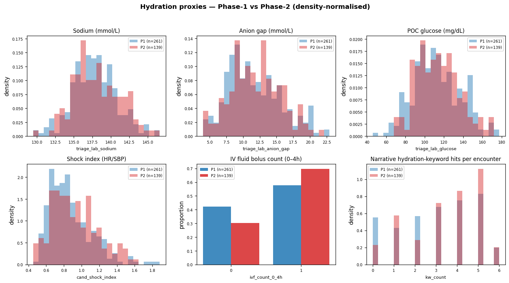
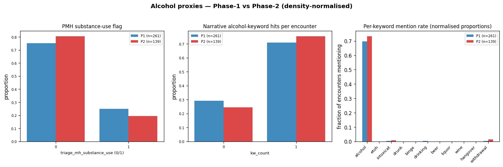

# Hydration & alcohol — Phase-1 vs Phase-2

No release contains an explicit `triage_hydration_status` or `triage_alcohol_status` column. This report compares the two phases on the closest available clinical proxies, with **density-normalised plots** so the 261-vs-139 cohort-size difference doesn't distort the visual comparison.

## Hydration proxies

| Proxy | P1 n | P2 n | P1 mean | P2 mean | P1 % > 0 | P2 % > 0 | Cohen d |
|---|---:|---:|---:|---:|---:|---:|---:|
| `hydration:triage_lab_sodium` | 261 | 139 | 137.795 | 138.077 | 100.0% | 100.0% | +0.09 |
| `hydration:triage_lab_anion_gap` | 261 | 139 | 11.659 | 11.929 | 100.0% | 100.0% | +0.07 |
| `hydration:triage_lab_glucose` | 261 | 139 | 112.302 | 114.047 | 100.0% | 100.0% | +0.07 |
| `hydration:cand_shock_index` | 261 | 139 | 0.871 | 0.923 | 100.0% | 100.0% | +0.21 |
| `hydration:ivf_count_0_4h` | 261 | 139 | 0.579 | 0.698 | 57.9% | 69.8% | +0.25 |
| `hydration:narrative_keyword_count` | 261 | 139 | 2.981 | 3.396 | 86.2% | 94.2% | +0.23 |

**Interpretation cheat sheet** — what each proxy actually tells you about hydration status:

- **Sodium**: a higher mean suggests more volume contraction in that cohort.
- **Anion gap**: elevated → metabolic acidosis from lactate / ketones (often seen in volume depletion).
- **Glucose**: hyperglycaemia can drive osmotic diuresis (treatment-relevant for dehydration).
- **Shock index (HR/SBP)**: > 0.9 → likely volume depletion / impending shock.
- **IV fluid bolus count**: clinician-administered rehydration; downstream proxy.
- **Narrative-keyword hits**: free-text clinician mentions of dehydration / hydration / IV-fluid words across the four narrative blocks. Useful when the structured fields don't capture it directly.

## Alcohol proxies

| Proxy | P1 n | P2 n | P1 mean | P2 mean | P1 % > 0 | P2 % > 0 | Cohen d |
|---|---:|---:|---:|---:|---:|---:|---:|
| `alcohol:triage_mh_substance_use` | 261 | 139 | 0.249 | 0.194 | 24.9% | 19.4% | -0.13 |
| `alcohol:narrative_keyword_count` | 261 | 139 | 0.709 | 0.755 | 70.9% | 75.5% | +0.10 |

### Per-keyword mention-rate breakdown

Fraction of encounters whose narrative notes mention each keyword at least once.

| Keyword | P1 % notes | P2 % notes | Δ (pp) |
|---|---:|---:|---:|
| `alcohol` | 69.73% | 73.38% | +3.6 |
| `etoh` | 0.00% | 0.00% | +0.0 |
| `intoxicat` | 0.38% | 0.72% | +0.3 |
| `drunk` | 0.00% | 0.00% | +0.0 |
| `binge` | 0.00% | 0.00% | +0.0 |
| `drinking` | 0.38% | 0.00% | -0.4 |
| `beer` | 0.00% | 0.00% | +0.0 |
| `liquor` | 0.00% | 0.00% | +0.0 |
| `wine` | 0.00% | 0.00% | +0.0 |
| `hangover` | 0.00% | 0.00% | +0.0 |
| `withdrawal` | 0.38% | 1.44% | +1.1 |

## Files

- `derived/phase2/hydration_alcohol_table.csv`
- `derived/phase2/alcohol_keyword_breakdown.csv`
- `derived/phase2/eda_plots/hydration_density.png`
- `derived/phase2/eda_plots/alcohol_density.png`
